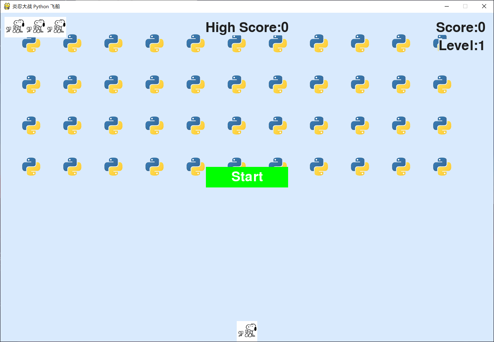

# PythonAlien

简单的类小蜜蜂游戏，使用 Python 编写，学习练手

# 预览

# 游戏说明

按 Q 退出游戏，点击 Start 按钮或者按 P 开始游戏，左右方向键移动，空格发射子弹，一共三条生命。打完一波会升级，分数更高速度更快。

界面显示了 `当然分数`、`最高分数`、`生命值`、`等级`，图片和背景等可自定义

# 注意

正式运行前请先去 `settings.py` 修改图片路径

# 如何使用

## 准备

* 确保自己电脑安装了 Python 3，我自己使用的是 Python 3.8
* `pip`    Python 3.4 以上已内置
* `virtualenv`    Python 的虚拟环境，使用 `pip install virtualenv ` 来安装

## 创建环境

* 使用 `virtualenv venv` 来创建一个虚拟环境，名字可以自己定义
* 激活虚拟环境，不同的系统不太一样，请自行百度

## 拉取源码

确认现在在虚拟环境的根目录，使用 `git clone https://github.com/EndureBlaze/PythonAlien .` 克隆源码到当前目录

## 安装依赖包

cd 到 `whls` 目录，使用 `pip install -r requirements.txt` 来安装虚拟环境内部的依赖库

## 执行

在虚拟环境根目录执行 `python alien_invasion.py` 即可运行，~~也可以用 VS Code 运行，选择 Python 解析器即可~~

# 配置

运行前注意，请去 `settings.py` 里修改图片路径，防止运行失败，其他配置也在该文件下修改，我已经写好注释
